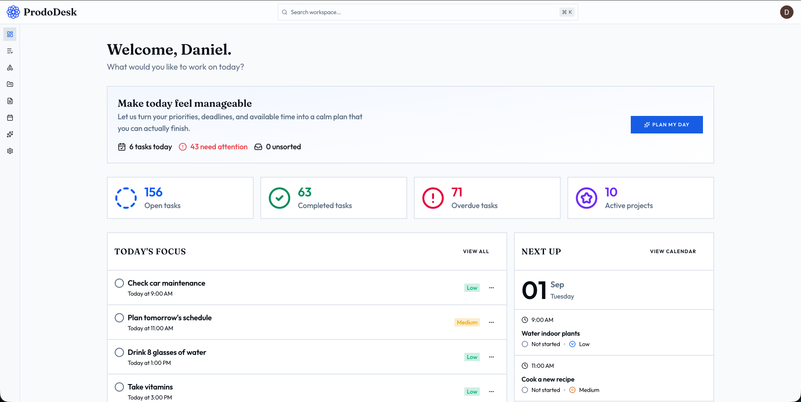
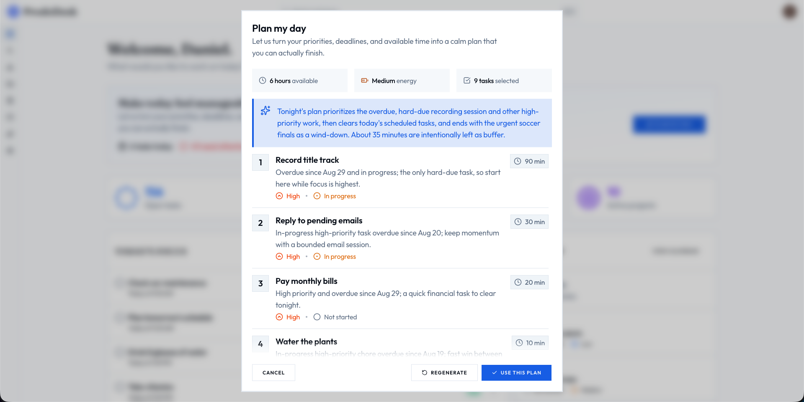
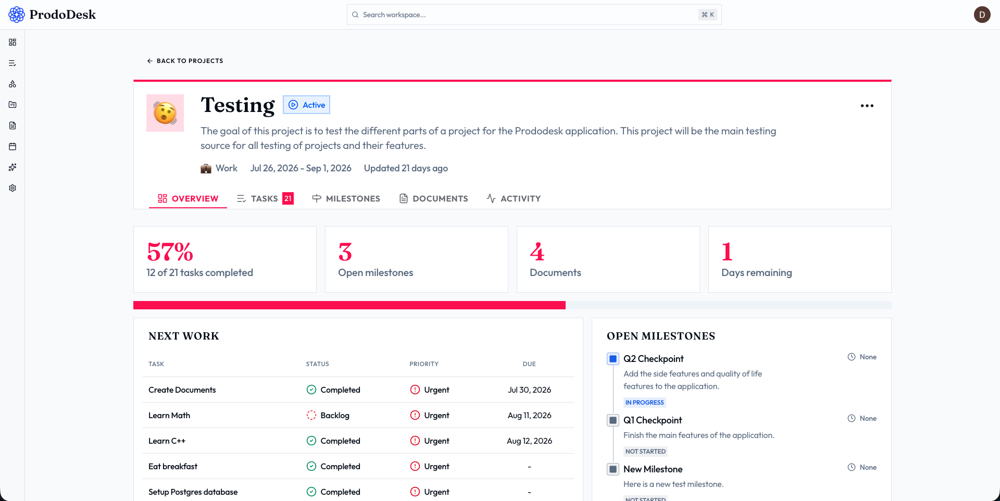

# [ProdoDesk](https://prododesk.vercel.app)

## Overview

ProdoDesk is a productivity platform that unifies all your tasks, projects, milestones, and documents into one cohesive workspace with AI. Users can organize their tasks, projects, and resources in any way they can imagine and the AI suggests next steps or plans the day for them.

## What It Does

Some of the main features are:

- Personalized dashboard with recent stats and resources
- AI-powered daily planning based on your energy level and available time
- Task triage that helps organize your unsorted work
- Flexible task views with sorting
- Calendar view for scheduled tasks and upcoming deadlines
- Areas for organizing projects
- Projects with outcomes, progress tracking, and associated tasks, milestones, documents, and activity
- Milestones to break larger projects into steps
- Rich-text documents
- ProdoDesk AI for creating, updating, finding, and organizing your workspace
- Detailed activity tracking
- Secure authentication and ownership checks
- Pagination and infinite scrolling for efficient data fetching
- Responsive UI that supports light and dark modes

## Screenshots / Photos

| Dashboard                                   | AI Day Planning                                               | Project Workspace View                                         |
| ------------------------------------------- | -------------------------------------------------------------- | ----------------------------------------------------------- |
|  |  |  |

## About the project

I wanted to create my own platform to help me organize my tasks and projects tailored to my preferences and workflows. Building this project also taught me many valuable lessons and skills. The entire project from start to first usable prototype took **7-9 weeks** of planning, careful design, thought about user needs and UI, and actually building it out, feature by feature. I hope to continue working on this project and turn this into something real used by real people.

## Try it out!

Go to the [ProdoDesk](https://prododesk.vercel.app) website, hosted on Vercel.

## How to Use

The application has many features you can explore. First go to the [ProdoDesk](https://prododesk.vercel.app) website and create an account (note that the platform DOES send an email verification OTP when you sign in with email-password). You can create some tasks, play around with the numerous features the platform has to offer. Note that the AI features directly depend on HackClub AI so they might not work if HackClub AI is down.

If you would rather run this locally, I have instructions below.

## Tech Stack

- Next.js with React & Typescript
- Neon for DB and Drizzle as the ORM
- Better Auth for secure, easy authentication
- Mailjet for sending emails
- Tailwind CSS for styling and Shadcn UI for easy-to-edit and reusable components
- React Hook Form handles easy form input field management and Zod handles form validation and input validation
- Tiptap for rich-text document editing experience
- Vercel AI SDK and OpenRouter (through HackClub AI) for structured AI generation, streamed responses, tool calling, and AI features
- TanStack Query for client-side data fetching
- date-fns for date/timezone handling
- dnd-kit for drag and drop interactions
- Tigris for S3-compatible object storage for images and files
- PNPM as the package manager

## Components / Dependencies

To run this project you will need a few things setup:

- Node.js (At least version 20.9, check the Next.js docs for more information)
- PNPM (The package manager used in this project)
- Git (To clone the repo to your local machine)

## Setup Instructions

### 1. Install Node.js (Skip if you already have installed)

Go to the [Node.js website](https://nodejs.org/en) and follow the installation instructions there to install it on your machine. To verify it is working, you can enter the following command:

```bash
node --version
npm --version
```

If both commands run successfully and print out version numbers with no "not found" errors, then you are good to go.

### 2. Install PNPM

This project uses PNPM as the package manager. To install, run:

```bash
npm install -g pnpm@latest
```

Once installed, you can verify it is working by running the following command:

```bash
pnpm --version
```

If it prints a version number with no errors, then you are good to go. Otherwise, please refer to the [PNPM documentation](https://pnpm.io/installation) for more information.

### 3. Install Git (If not already installed)

Go to the [Git website](https://git-scm.com) and follow the installation instructions there to install it on your system (if you don't already have it).

Then run the following command to verify that it works:

```bash
git --version
```

If no errors are raised, then you are good to continue.

### 4. Clone the Repo!

To clone, run:

```bash
git clone https://github.com/Danieldkdao/prododesk.git
cd prododesk
pnpm install
```

Once finished, open the project in your favorite IDE or code editor.

## Configuration

Because the project uses @t3-oss/env-nextjs for environment variables, it will throw an error if you try to run the application without any of the following variables in an .env file at the root of the application:

```text

# Database
DATABASE_URL=

# Better Auth
BETTER_AUTH_URL=
BETTER_AUTH_SECRET=

# Google
GOOGLE_CLIENT_SECRET=
GOOGLE_CLIENT_ID=

# GitHub
GITHUB_CLIENT_SECRET=
GITHUB_CLIENT_ID=

# Mailjet
MAILJET_API_KEY=
MAILJET_API_SECRET=
SENDER_EMAIL=

# AI
HACK_CLUB_AI_API_KEY=

# Search the web
FIRECRAWL_API_KEY=

# Image and file uploads
TIGRIS_STORAGE_SECRET_ACCESS_KEY=
TIGRIS_STORAGE_ACCESS_KEY_ID=
TIGRIS_STORAGE_ENDPOINT=
TIGRIS_STORAGE_BUCKET=
NEXT_PUBLIC_TIGRIS_STORAGE_BUCKET=
```

## Running the Project

To start the project locally, simply run:

```bash
pnpm db:push
pnpm dev
```

To confirm that the project is running successfully, you can go to [localhost:3000](http://localhost:3000) in your browser. If you see the landing page, then it worked!

To build the project for production, you can run:

```bash
pnpm build
```

See the package.json for more information.

## Troubleshooting

There are a few bottlenecks that might impact the experience of using the website:

- Hackclub AI is used for some features. If the service is down, some AI features might not work.

#### For local development

If you ran into any issues while trying to run the project locally, you can Google the issue or ask an LLM for help.

#### On the live website

If you found a bug, an issue, or just have a feature request please don't hesitate to email me at [danieldkdao@gmail.com](mailto:danieldkdao@gmail.com). I am actively working on this and I hope to make this a real thing used by real people, so I would appreciate any feedback or requests you may have!

## Credits

The project was solely my creation with some AI assistance. No outside reference regarding the initial idea or code was used.

### AI Usage

AI was used for some tasks which I have documented below. Every line of AI generated code was read, understood, and tweaked if necessary.

- Help troubleshoot and fix bugs
- Suggest next steps and new features
- Helped in researching documentation for new packages/libraries
- Helped me with code reviews and testing
- Automate boring, mundane tasks
- Suggest ideas for the UI

No other people worked on this project other than myself.

## License

This project is licensed under the MIT license.
